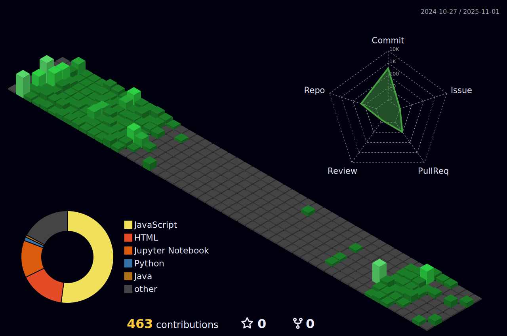

A little about what I'm up to: 

- 🔭 Currently “working on” figuring out life (and some Data stuff)
- 🌱 Learning Python, .NET, C#… and how not to break my code
- 👯 Open to collaborate on anything fun, or projects that don’t explode
- 💬 Ask me about random ideas I’ll never finish (I yap a lot)
- 📫 Reach me at: faizzmi74@gmail.com (pls no spam)
- 😄 Pronouns: He/Him (but also “bro” works)
- ⚡ Fun fact: My WiFi decides my productivity

## About Me
Just a regular human who spends way too much time on screens, survives mostly on coffee, and pretends to know what’s going on. Always curious, occasionally chaotic, and probably overthinking things right now.

  

## 💼 Experience
- **Agile Methodologies**: 1 year (internship and academic projects)
- **Front-End Development**: 2 years (Angular, Ionic Angular, HTML, CSS, JavaScript, TypeScript)
- **API Integration**: 1 year (integrated RESTful APIs in multiple projects)
- **Testing & Optimization**: 1 year (enhanced testing and delivery processes)
- **Back-End Development**: 1 year (Laravel and PHP-based systems)
- **Computer Vision**: 1 year (Python and OpenCV final year projects)
- **Version Control**: 2 years (GitHub, GitLab, BitBucket for project management and collaboration)

# 💻 Tech Stack:

  <!-- Programming Languages -->
  <h3>Programming Languages</h3>
  <code></code>
  
  <code></code>
  
  <code></code>
  
  <code></code>
  
  <code></code>
  
  <code></code>
  
  <code></code>
  
  <code></code>
  
  <code></code>
  

  <!-- Frameworks -->
  <h3>Frameworks</h3>
  <code></code>
  
  <code></code>
  
  <code></code>
  
  <code></code>
<!--   
  <code></code> -->
  
  <code></code>
  
  <code></code>
  
  <code></code>
  
  <code></code>
  
  
  <!-- Databases -->
  <h3>Databases</h3>
  <code></code>
  
  <code></code>
  
  
  <!-- Tools -->
  <h3>Tools</h3>
  <code></code>
  
  <code></code>
  
  <code></code>
  
  <code></code>
  
  <code></code>
  
  <code></code>
  
  <code></code>
  
  <code></code>
  
  <code></code>
  
  <code></code>
  
  <code></code>
  
  <code></code>
<!--   
  <code></code> -->

## 📊 GitHub Journey:

<table align="center" width="100%" height="100%" >
    <tr>
       <td></td>   
       <td></td>
    </tr>
 </table>

 <table align="center" width="100%" height="100%" >
    <tr>
        <td></td>
        <td>
        <td></td>
        <td></td>
    </tr>
 </table>
 
 ## 🎮 Contributions
 
 
 
 
## 🏆 GitHub Trophies

## ☎️ Contact Me:
 

---
